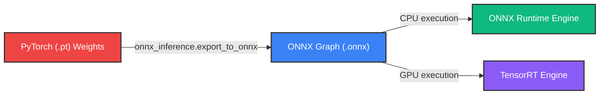
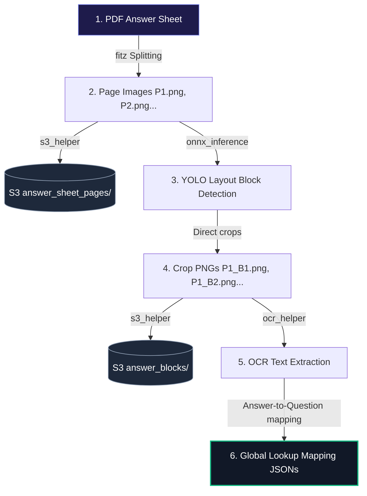

# 🤖 YOLO11s Document Layout Inference Hub 📄

Welcome to the **Marksense Document Layout & Pipeline Hub**. This repository contains the optimized assets, model specifications, and execution scripts for our fine-tuned **YOLO11s Document Layout Model**, built to split, segment, analyze, and map handwritten student answer sheets.

---

## 📋 1. Model Overview & Class Definitions

The layout model segments document elements into 9 semantic classes. These colored borders help downstream optical character recognition (OCR) and layout analysis tools structure pages:

| Class ID | Class Name | Target Element | Visual Indicator | RGB Color |
| :---: | :--- | :--- | :---: | :--- |
| **0** | `block_text` | Standard paragraph text blocks | 🔵 | Indigo (`99, 102, 241`) |
| **1** | `block_diagram` | Visual illustrations, drawings | 🟡 | Yellow (`255, 234, 0`) |
| **2** | `block_table` | Tabular grids, matrices | 🟢 | Green (`16, 185, 129`) |
| **3** | `block_rough` | Hand-written scribbles, draft work | 🟠 | Amber (`245, 158, 11`) |
| **4** | `block_empty` | Empty structural padding blocks | ⚫ | Gray (`107, 114, 128`) |
| **5** | `question` | Primary question text boundaries | 💗 | Pink (`236, 72, 153`) |
| **6** | `sub_question` | Sub-parts or nested questions | 🟣 | Purple (`139, 92, 246`) |
| **7** | `block_graph` | Chart plots, line/bar/pie charts | 🐟 | Cyan (`6, 182, 212`) |
| **8** | `block_map` | Cartographic maps, spatial plots | 🔴 | Red (`239, 68, 68`) |

---

## ⚙️ 2. Model Architecture & Resource Metrics

* **Base Network:** YOLO11s (Small variant—optimized balance between speed and precision)
* **Parameter Count:** `~9.4 Million` parameters
* **File Weights Footprint:**
  * **Production Weights (`custom_best.pt` / `best.onnx`):** `~19.3 MB` (stripped weights, clean of optimizer gradients)
  * **Training Checkpoint (`110-best.pt`):** `~76 MB` (includes PyTorch optimizer state)
* **Runtime Footprint (RAM):**
  * **Warmup RAM state:** `< 100 MB`
  * **Peak memory (300 DPI image buffers):** `< 500 MB`

---

## ⚡ 3. Latency & Performance Specifications

*Inference bench times evaluated on high-resolution **300 DPI** scanned pages ($2480 \times 3508$ pixels):*

### 🟢 Server GPU (NVIDIA T4 Instance)
* **Parallel Batch Mode ($imgsz=640$):** **`10 - 15 ms` per page** (Throughput: $65+$ pages/sec)
* **High-Res Single Mode ($imgsz=1280$):** **`35 - 50 ms` per page** (Throughput: $20+$ pages/sec)

### 🔵 Local CPU (standard Core i7 / VCPU)
* **Optimized ONNX Runtime ($imgsz=640$):** **`70 - 110 ms` per page** (Throughput: $9+$ pages/sec)
* **Raw PyTorch Runtime ($imgsz=1280$):** **`250 - 420 ms` per page** (Throughput: $2+$ pages/sec)

---

## 📈 4. Optimization & Export Techniques (ONNX Roadmap)



> [!TIP]
> **Why ONNX Export?**
> * **2x to 3x Speedup:** Cuts CPU execution latency by **60% to 70%**.
> * **Slimmer Containers:** Replaces PyTorch ($2+$ GB dependency) with `onnxruntime` ($~80$ MB), significantly shrinking production Docker image sizes.

---

## 📂 5. Workspace Directory Structure

```text
inferences/
├── models/                  # Fine-tuned PyTorch (.pt) and optimized ONNX (.onnx) weights
│   ├── 110-best.onnx
│   ├── 110-best.pt
│   ├── best.onnx
│   ├── best.pt
│   └── custom_model.onnx
├── samples/                 # Test images and benchmark outputs
│   ├── cli_custom_onnx_test.jpg
│   ├── cli_onnx_test.jpg
│   ├── output.jpg
│   └── output_test.jpg
├── .env                     # Centralized project configuration (AWS/OCR settings)
├── .env.example             # Template variables for .env
├── s3_helper.py             # S3 AWS Uploader & local directory simulator
├── ocr_helper.py            # OCR Engine wrapper (EasyOCR, PyTesseract, Mock fallbacks)
├── run_pipeline.py          # End-to-end Marksense processing pipeline
├── app.py                   # Streamlit Interactive Playground & Latency Router
├── predict.py               # Standalone OpenCV bounding box annotation CLI
├── onnx_inference.py        # CPU-optimized ONNX inference engine wrapper
├── requirements.txt         # Python dependencies manifest
└── packages.txt             # Headless Linux server dependencies (OpenGL/OpenCV)
```

---

## 🔄 6. Marksense End-to-End Pipeline (`run_pipeline.py`)

The pipeline automates the processing of student answer sheets. It coordinates splitting, uploading, layout detection, cropping, text extraction, and mapping:



### ⚙️ Pipeline Configuration
Variables are loaded from the project's local [.env](file:///d:/NextLeap/block%20detection/inferences/.env) file:
* `USE_LOCAL_STORAGE`: Toggle `True` for offline filesystem storage or `False` for real AWS S3 upload.
* `OCR_ENGINE`: Options are `easyocr`, `pytesseract`, or `mock` (resilient offline fallback).

### 📁 Dynamic S3 Folder Architecture
Files are structured inside the S3 bucket using student-specific metadata prefixes:
```text
{school_name}/{academic_year}/{class}/{section}/{subject}/{assessment_id}/students/{student_id}/
├── answer_sheet_pages/
│   ├── P1.png
│   └── P2.png
└── answer_blocks/
    ├── P1_B1.png
    ├── P1_B2.png
    └── P2_B1.png
```

### 🚀 Execution Command
Execute the end-to-end pipeline run from the CLI using:
```bash
python run_pipeline.py \
  --input samples/cli_onnx_test.jpg \
  --student-id 11 \
  --school-name scholars_home \
  --academic-year 2025-2026 \
  --class 9th \
  --section 9th-A \
  --subject SCIENCE_CHEMISTRY \
  --assessment-id Assessment1 \
  --marksense-uuid ms_456 \
  --question-paper-uuid qp_789
```

### 📄 Metadata JSON Outputs
The pipeline outputs four structured JSON results inside the `outputs/` directory:
* **`res_pages.json`**: Pages indices mapped to S3 URLs in global sheet order.
* **`res_blocks.json`**: Cropped block metadata including bounding boxes (`{x, y, w, h}`), types, and question anchor tags.
* **`res_contents.json`**: Extracted OCR text strings matched with block URLs.
* **`res_lookup.json`**: Maps standard student responses (answers, drawings, tables) to their preceding question anchors.

---

## 🎨 7. Streamlit Dashboard & Testing Utilities

### Run the Interactive Dashboard:
Starts a local Streamlit web application on port `8501`:
```bash
streamlit run app.py
```
*Allows uploading batch files, adjusting confidence thresholds, checking latency, and downloading annotated layout previews.*

### Run Standalone CLI Script:
Outputs an annotated JPEG visualization image showing layout outlines:
```bash
python predict.py --image samples/cli_onnx_test.jpg --weights models/best.onnx --output samples/output.jpg
```
