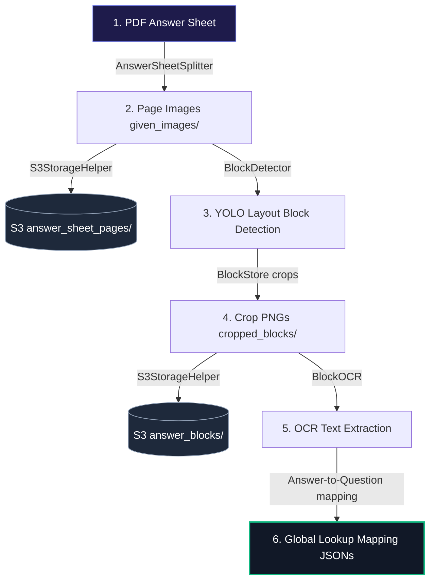

# 🤖 YOLO11s Document Layout & Marksense Pipeline Hub 📄

This repository contains two primary modules structured around modular, PEP8-compliant class helpers:
1. **Interactive Layout Inference & Visualization Utilities** ([app.py](file:///d:/NextLeap/block%20detection/inferences/app.py) and [predict.py](file:///d:/NextLeap/block%20detection/inferences/predict.py)): Visual playground tools designed to display, test, and annotate YOLO model detections using drawn bounding boxes.
2. **End-to-End Production Processing Pipeline** ([run_pipeline.py](file:///d:/NextLeap/block%20detection/inferences/run_pipeline.py)): The core coordinator that converts student PDF sheets to images, uploads pages to S3, crops layout elements, uploads block crops to S3, runs OCR text extraction, and maps student answers to question anchors—returning clean, structured JSON payloads.

---

## 📋 1. Core Model Class Definitions

The YOLO model segments document elements into 9 distinct semantic layout classes:

| Class ID | Class Name | Target Element | Visual Indicator | Default Color (RGB) |
| :---: | :--- | :--- | :---: | :--- |
| **0** | `block_text` | Standard paragraph text blocks | 🔵 | Indigo (`99, 102, 241`) |
| **1** | `block_diagram` | Visual illustrations, drawings | 🟡 | Yellow (`255, 234, 0`) |
| **2** | `block_table` | Tabular grids, matrices | 🟢 | Green (`16, 185, 129`) |
| **3** | `block_rough` | Hand-written scribbles, draft work | 🟠 | Amber (`245, 158, 11`) |
| **4** | `block_empty` | Empty structural padding blocks | ⚫ | Gray (`107, 114, 128`) |
| **5** | `question` | Primary question text boundaries | 💗 | Pink (`236, 72, 153`) |
| **6** | `sub_question` | Sub-parts or nested questions | 🟣 | Purple (`139, 92, 246`) |
| **7** | `block_graph` | Chart plots, line/bar/pie charts | 🔷 | Cyan (`6, 182, 212`) |
| **8** | `block_map` | Cartographic maps, spatial plots | 🔴 | Red (`239, 68, 68`) |

---

## 🛠️ 2. Setup & Installation

Install python dependencies from the manifest:
```bash
pip install -r requirements.txt
```
*(For headless Linux servers, `packages.txt` lists the `libgl1` and `libglib2.0-0` system packages required by OpenCV).*

---

## 🔄 3. Production Marksense Processing Pipeline (`run_pipeline.py`)

> [!IMPORTANT]
> **Production Coordinator & Modular Helpers**
> The marksense pipeline is modularly organized under the [helpers/](file:///d:/NextLeap/block%20detection/inferences/helpers) directory, containing classes dedicated to each individual step (splitting, detection, S3 uploads, OCR, normalization, and block storing). It uses PyTorch (`.pt` checkpoints) for inference execution.

### 📶 Pipeline Architecture & Workflow



### ⚙️ Pipeline Configuration (`.env` file)
Rename [.env.example](file:///d:/NextLeap/block%20detection/inferences/.env.example) to `.env` and configure your credentials.

* **AWS S3 Credentials:** Define `AWS_ACCESS_KEY_ID`, `AWS_SECRET_ACCESS_KEY`, `AWS_REGION`, and `S3_BUCKET_NAME`.
* **Local Storage Toggle:** Set `USE_LOCAL_STORAGE=True` to run offline (saves files in `outputs/local_s3_mock` mimicking S3 paths) or `False` to run real S3 uploads.
* **OCR engine selection:** Set `OCR_ENGINE=mock` (instant offline testing), `easyocr` (local deep learning model), or `pytesseract` (local Tesseract wrapper).

### 📁 Dynamic S3 Folder Architecture
When uploading, S3 files are structured dynamically using student parameters:
```text
{school_name}/{academic_year}/{class}/{section}/{subject}/{assessment_id}/students/{student_id}/
├── answer_sheet_pages/
│   ├── P1.png            <-- Page 1 Image
│   └── P2.png            <-- Page 2 Image
└── answer_blocks/
    ├── P1_B1.png         <-- Page 1, Crop Block 1
    ├── P1_B2.png         <-- Page 1, Crop Block 2
    └── P2_B1.png         <-- Page 2, Crop Block 1
```

### 🚀 Pipeline Execution Command
To run the production pipeline, execute the following command:
```bash
python run_pipeline.py --input samples/cli_onnx_test.jpg --school-name scholars_home --academic-year 2025-2026 --class 9th --section 9th-A --subject SCIENCE_CHEMISTRY --assessment-id Assessment1 --student-id 11 --marksense-uuid ms_456 --question-paper-uuid qp_789 --output-dir outputs
```

### 📄 Output Directory Structure
After execution, the `--output-dir` (default: `outputs`) contains the structured JSON responses and intermediate directories:
```text
outputs/
├── given_images/
│   └── page_001.png              <-- Copy of the input pages split from PDF
├── detected_images/
│   └── detected_page_001.png     <-- Visual layout boxes drawn on top
├── cropped_blocks/
│   ├── P1_B1.png                 <-- Crop Block 1 image
│   └── P1_B2.png                 <-- Crop Block 2 image
├── res_pages.json                <-- Page sequence linked to S3 URLs
├── res_blocks.json               <-- Class types, S3 URLs, and {x, y, w, h} coordinates
├── res_contents.json             <-- OCR text results mapping
└── res_lookup.json               <-- Preceding question anchors mapped to answer block lists
```

---

## 🎨 4. Layout Playground & CLI Visualizers (`app.py` & `predict.py`)

These tools are designed to verify layout detection quality visually by drawing translucent color bounding box overlays on top of the images. Both scripts run purely on PyTorch (`.pt` checkpoints).

### 💻 Streamlit Web Application Dashboard
Starts a local Streamlit web application on port `8501`:
```bash
streamlit run app.py
```
* **Playground Mode:** Upload single or batch images to visually inspect YOLO detections, change confidence thresholds, download annotated drawings, and check coordinate data tables.

### 🖼️ Standalone CLI Visualization Script
Run a simple test on an image and save the visual drawing output:
```bash
python predict.py --image samples/cli_onnx_test.jpg --weights models/110-best.pt --output outputs/visual_output.jpg
```
*(This script loads the weights, detects blocks, overlays translucent class colors matching the 9 layout classes, and saves the image to `--output`).*
